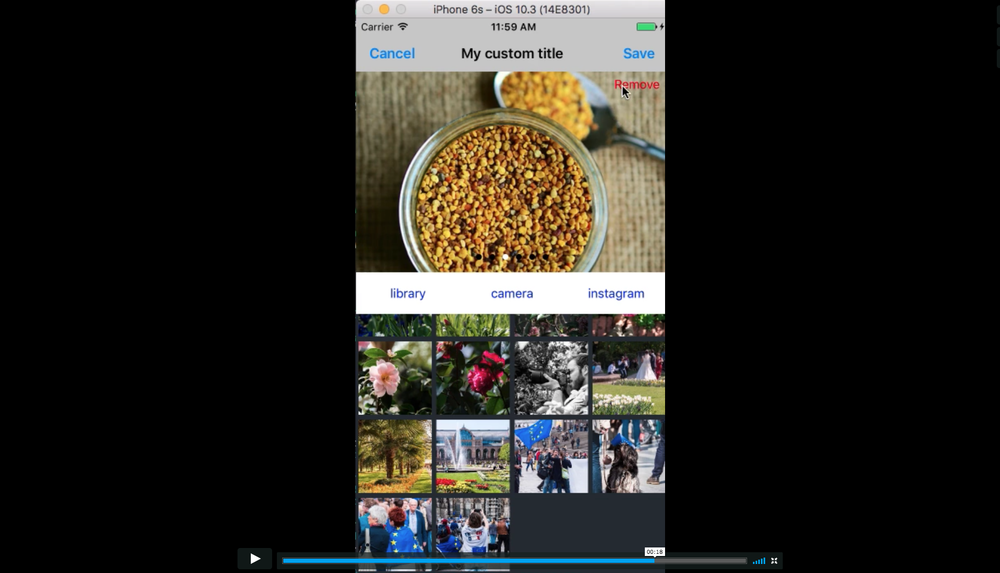

# FlaneurImagePicker

[](https://travis-ci.org/FlaneurApp/FlaneurImagePicker)
[](http://cocoapods.org/pods/FlaneurImagePicker)
[](http://cocoapods.org/pods/FlaneurImagePicker)
[](http://cocoapods.org/pods/FlaneurImagePicker)

## Video Preview

[](https://vimeo.com/228042101)

## Example

To run the example project, clone the repo, and run `pod install` from the Example directory first.

## Requirements

* Xcode 8 and iOS 9.0

## Installation

FlaneurImagePicker is available through [CocoaPods](http://cocoapods.org). To install
it, simply add the following line to your Podfile:

```ruby
pod "FlaneurImagePicker"
```

## Getting Started

To launch the Flaneur Image Picker:

```swift
#import FlaneurImagePicker

let imagePicker = FlaneurImagePickerController(maxNumberOfSelectedImages: 10, userInfo: nil, sourcesDelegate: [], selectedImages: [])

imagePicker.delegate = self

self.present(imagePicker, animated: true, completion: nil)
```

Implement the FlaneurImagePickerControllerDelegate protocol:

```swift
extension ViewController: FlaneurImagePickerControllerDelegate {
    func didPickImages(images: [FlaneurImageDescription], userInfo: Any?) {
        print("didPickImages")
    }

    func didCancelPickingImages() {
        print("didCancelPickingImages")
    }
}
```

<a name="plist_section"></a>
You need to add values in your .plist file for the different sources:

```
  <key>NSCameraUsageDescription</key>
  <string>This application needs to access your camera</string>

  <key>NSPhotoLibraryUsageDescription</key>
  <string>This application needs to access your photo library</string>

  <key>InstagramClientID</key>
  <string>YOUR_INSTAGRAM_CLIENT_ID</string>

  <key>InstagramRedirectURI</key>
	<string>YOUR_INSTAGRAM_REDIRECT_URI</string>
```

## Configuration

In order to configure the picker you can use the config object of the picker:

```
// Changes the cancel button's title
imagePicker.config.cancelButtonTitle = "Cancel"

// Changes the done button's color
imagePicker.config.doneButtonColor = .brown

// Changes the remove button's color
imagePicker.config.removeButtonColor = .red

// Changes the order of the sections
 imagePicker.config.sectionsOrderArray = [.imageSources, .pickerView, .selectedImages]

 // Changes the title for the one or more imageSources
 imagePicker.config.titleForImageSource = [.instagram: "Insta."]

 // Changes height for one or more sections
 imagePicker.config.heightForSection = [.selectedImages: Int(UIScreen.main.bounds.height / CGFloat(3)), .imageSources: 50]

// You can find all the possible configurations in the documentation
// as well as an example in the Example directory of the repo
 ...
```
## Instagram

To configure instagram, you need to go on the [instagram developer website](https://www.instagram.com/developer/)

- Create an account
- Go to the tab "Manage Clients"
- Register a New Client
- Fill the information
- Go back to the tab "Manage Client"
- Click on the button "Manage"
- Go to the tab "Security"
- Uncheck "Disable implicit OAuth"
- Enter a valid redirect URIs (the redirect URI that you choose doesn't really matter as long as it's an https address, you could use https://google.com for example)
- Copy the redirectURI in your .plist file (as explained [here](#plist_section))
- Copy the ClientID in your .plist file as explained [here](#plist_section))

When you create an account, you are in sandbox mode which means that you can only request the most 20 recents media of the user.

!!! Remember that media means PHOTOS AND VIDEOS, so if you only see 10 photos appearing in the picker, it means either that you only have 10 photos or that the rest of your most recent medias are videos !!!

In oder to test the picker when you're in sandbox mode, you need to add the users as sandbox users, to do so:

- Go to the tab "Sandbox"
- Enter the username of the user
- The user has to go to [instagram developer website](https://www.instagram.com/developer/)
- Create a developer account
- Go to Sandbox Invites
- And accept your invitation
- Then and ONLY THEN he can use the Picker

If you want to leave the Sandbox mode, you need to submit your app to instagram, read the documentation to do so: [instagram developer website](https://www.instagram.com/developer/)

## Documentation

You can find the documentation in *doc* folder of the repository.
Open the index.html to view the documentation.

## Author

FlaneurApp, flaneurdev@bootstragram.com

## License

FlaneurImagePicker is available under the MIT license. See the LICENSE file for more info.
